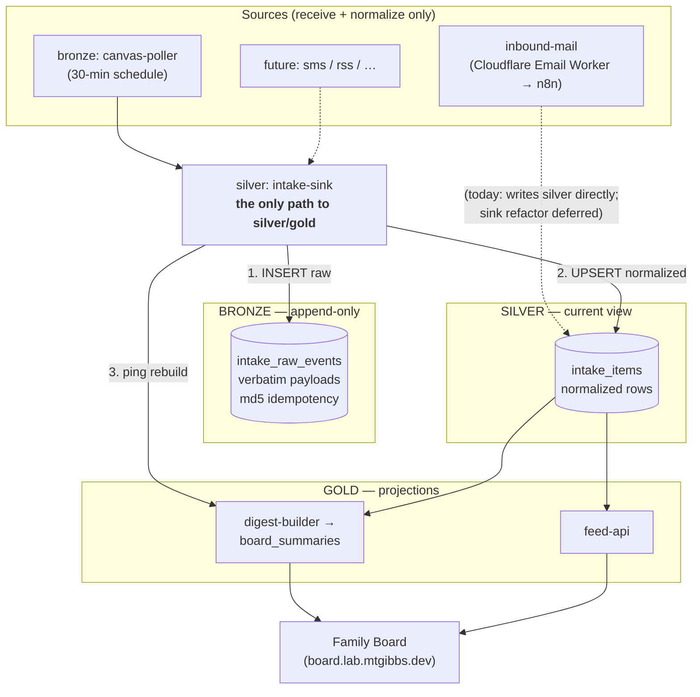

# Family Data Architecture — Bronze / Silver / Gold

> How family information flows from many sources (forwarded email, Canvas, future
> feeds) into the Family Board and digest, through one shared, append-only ingestion
> spine. This is the "medallion-lite" design: raw → normalized → projections, all in
> Postgres, all wired by n8n. No Kafka, no dbt — just three named tiers and one Sink.

- **Spec (source of truth):** [`specs/modular-ingestion/spec.md`](../specs/modular-ingestion/spec.md)
- **Canvas operator runbook:** [`docs/canvas-ingestion.md`](./canvas-ingestion.md)
- **Digest data contract:** [`docs/digest-api.md`](./digest-api.md)
- **Status:** live as of 2026-05-29 (email + Canvas sources both flowing)

---

## The three tiers

| Tier | Table / surface | Role | Mutability |
| :--- | :--- | :--- | :--- |
| **Bronze** | `intake_raw_events` | "We saw this happen." Every source payload, verbatim. | **Append-only.** No UPDATE/DELETE outside a future `ops:` redact workflow. |
| **Silver** | `intake_items` | "Current view of the world." Normalized rows the board/digest read. | UPSERT on `item_key`; optional group-cleanup. |
| **Gold** | `board_summaries`, feed projections | Purpose-built outputs (digest, feed). | Rebuilt from silver; never touches bronze. |

**Why bronze exists:** so a future app, a smarter prompt, or a point-in-time question can
**replay/rehydrate** from history. The "current view" (silver) is lossy by design; bronze
is the durable record. If we'd only kept silver, we could never reconstruct what a source
actually sent.

---

## The flow



> **Note on `inbound-mail`:** the email source predates the Sink and still writes silver
> directly. Refactoring it to call the Sink is an explicit follow-up (spec §5) — it works
> as-is, and Canvas proved the Sink contract first.

---

## The Intake Sink contract

The Sink (`silver: intake-sink`, n8n id `bcCwJeWqD61TpIW2`) is the **only API the system
depends on**. A source calls it once per event with a single JSON envelope:

```jsonc
{
  "source_channel": "canvas:fultonschools",          // REQUIRED — "<source-type>:<provider>"
  "source_msg_id":  "canvas:cal_assignment:481156:9", // REQUIRED — stable identity of the event
  "event_type":     "canvas.calendar_assignment",     // REQUIRED — "<source-type>.<kind>"
  "source_subject": "Spanish 1 — Quiz DOP",           // optional
  "source_from":    "canvas:calendar_events",         // optional
  "source_received_at": "2026-06-12T03:59:59Z",       // optional (source's own timestamp)
  "payload":        { /* raw verbatim */ },           // REQUIRED — JSON-serializable
  "attachments_r2": null,                             // optional — [{key,bucket,…}] R2 refs only
  "normalized_rows": [ /* intake_items shape, see below */ ],
  "cleanup_msg_group": false                          // optional — delete stale rows for this msg_id
}
```

**What the Sink does, in order:**

1. **INSERT** into `intake_raw_events` — `ON CONFLICT (source_channel, source_msg_id,
   payload_hash) DO NOTHING`. Idempotent: same payload twice → second is a no-op.
2. **UPSERT** each `normalized_rows[i]` into `intake_items` — `ON CONFLICT (item_key) DO
   UPDATE`.
3. If `cleanup_msg_group: true` — DELETE silver rows for this `source_msg_id` whose
   `item_key` isn't in the provided set (handles re-extraction shrinking a message).
4. Fire-and-forget `POST /webhook/digest-rebuild` (`continueOnFail` — a failed ping never
   fails the Sink; the hourly schedule is the backstop).

**Returns:** `{ raw_id, raw_was_new, upserted:[{id,item_key}], deleted:[id], upserted_count, deleted_count }`.

**Invocation:** internal callers use n8n `Execute Workflow` (in-process). There's also a
webhook (`POST /webhook/intake-sink`, Header-Auth `Feed Token`) for standalone testing /
future external callers.

### `normalized_rows[]` shape

Each row is an `intake_items` record:

```jsonc
{
  "type": "assignment",          // assignment | missing | announcement | info | …
  "title": "Quiz DOP",
  "due_at": "2026-06-12T03:59:59Z",   // ISO, or null
  "student": "ronin",            // ronin | rory | both | unknown
  "action_required": true,
  "amount": null,                // string (e.g. dollar fee) or null
  "teacher": null,
  "course": "Spanish 1",
  "source_hint": "…",            // short context snippet
  "confidence": 1.0,
  "action_url": "https://…",     // a link to act on (assignment, booking, etc.) or null
  "action_target": null,         // a contact target (email/phone) or null
  "item_key": "canvas:cal_assignment:481156:9"  // MUST start with source_msg_id (dedup key)
}
```

> **Norm:** `item_key` must begin with the envelope's `source_msg_id`. The Sink throws if
> it doesn't — that prevents cross-message dedup collisions.

---

## Schemas

### `intake_raw_events` (bronze)

```sql
CREATE TABLE intake_raw_events (
  id              BIGSERIAL PRIMARY KEY,
  received_at     TIMESTAMPTZ NOT NULL DEFAULT now(),
  source_channel  TEXT NOT NULL,
  source_msg_id   TEXT NOT NULL,
  event_type      TEXT NOT NULL,
  payload         JSONB NOT NULL,
  payload_hash    TEXT GENERATED ALWAYS AS (md5(payload::text)) STORED,
  attachments_r2  JSONB,
  source_received_at TIMESTAMPTZ
);
CREATE UNIQUE INDEX intake_raw_idem    ON intake_raw_events (source_channel, source_msg_id, payload_hash);
CREATE        INDEX intake_raw_recent  ON intake_raw_events (source_channel, received_at DESC);
CREATE        INDEX intake_raw_payload ON intake_raw_events USING gin (payload jsonb_path_ops);
```

The `payload_hash` is a **generated column** (`md5(payload::text)`) — JSONB canonicalizes
key order/whitespace, so re-polling unchanged data hashes identically and the unique index
makes the insert a no-op. Idempotency for free.

### `intake_items` (silver)

Pre-existing table from the email pipeline. Canvas added no schema changes — it reuses
`type`, `student`, `due_at`, `action_url`, `action_target`, `item_key`, etc. See
[`docs/digest-api.md`](./digest-api.md) for the full column list and the digest's
deterministic locks.

---

## Conventions

### Workflow naming + n8n tags

| Tier | Tag | Name prefix | Examples |
| :--- | :--- | :--- | :--- |
| Bronze | `bronze` | `bronze: <source>` | `bronze: canvas-poller` |
| Silver | `silver` | `silver: <function>` | `silver: intake-sink` |
| Gold | `gold` | `gold: <function>` | (digest-api, feed-api — retag pending) |
| Ops | `ops` | `ops: <task>` | (intake-admin — retag pending) |

> Existing email-era workflows aren't renamed (spec §5) — conventions apply to new
> workflows; back-renames are cosmetic.

### Identity formats

- `source_channel`: `<source-type>:<provider>` — `intake@mtgibbs.dev` (legacy email),
  `canvas:fultonschools`, future `sms:twilio`, `rss:<host>`.
- `event_type`: `<source-type>.<kind>` — `email.received`, `canvas.calendar_assignment`,
  `canvas.missing_submission`, `canvas.announcement`.
- `source_msg_id` per source: email = Message-ID header; Canvas =
  `canvas:<kind>:<course_id>:<object_id>`.

### SQL discipline (learned the hard way)

- **Single-JSON-param pattern** for any INSERT/UPDATE with comma-bearing text:
  `queryReplacement = {{ JSON.stringify($json) }}` + SQL `$1::json->>'field'`. n8n's
  `queryReplacement` naively splits on commas otherwise, misaligning params.
- `ADD COLUMN IF NOT EXISTS`, `CREATE INDEX IF NOT EXISTS` everywhere (Ensure-Table steps
  run on every invocation).

---

## Safeguards

- **Bronze is append-only.** Only a future, human-reviewed `ops:` workflow may delete from it.
- **Idempotency is content-addressed** — `(source_channel, source_msg_id, payload_hash)`.
- **Sources never write silver/gold directly** (except legacy `inbound-mail`, pending refactor).
- **R2 refs only** — attachment bytes stay in R2 (`intake` bucket); bronze stores metadata.
- **No secrets in payloads** — receivers strip auth headers/tokens before handing to the Sink.
- **Digest ping is fire-and-forget** — never blocks ingestion.

---

## Live inventory (2026-05-29)

| Component | n8n id | Notes |
| :--- | :--- | :--- |
| `silver: intake-sink` | `bcCwJeWqD61TpIW2` | the Sink |
| `bronze: canvas-poller` | `NJV9pSpi4gerKqqx` | 30-min Canvas poll → Sink |
| `canvas-api` credential | `1avasNB9qofVhAG0` | httpHeaderAuth, scoped to `fultonschools.instructure.com` |
| `intake-db` postgres cred | `5bzmWi2TWDCyypLQ` | n8n Postgres (`n8n-postgresql.n8n.svc.cluster.local`) |
| `Feed Token` cred | `dgqc6ZiNll2avwOb` | shared Header-Auth for board/internal webhooks |
| `inbound-mail` | `3dA8CadFdrCw7xrQ` | email source (writes silver directly, pre-Sink) |
| `digest-builder` | `1oRsTfeaTHKjBcDN` | gold projection → `board_summaries` |
| `digest-api` / `feed-api` | `Ix9sgTblfHOja8hd` / `XW6Ie2Ui3AOLkjSu` | gold read surfaces |
| `intake-admin` | `mBk4ILTo3hoSrnNE` | ops: delete silver rows by id-list |

---

## Adding a new source (the whole point)

The Sink contract makes a third source a known-shape problem:

1. Write a **receiver** (schedule or webhook) that fetches/accepts the source data.
2. **Normalize** each item to the `normalized_rows[]` shape.
3. **Call the Sink** (Execute Workflow or its webhook) — one envelope per event.
4. Tag the workflow `bronze: <source>`; pick a `source_channel` and `source_msg_id` format.

No new SQL, no new tables, no touching the digest. Receive → normalize → call Sink.
