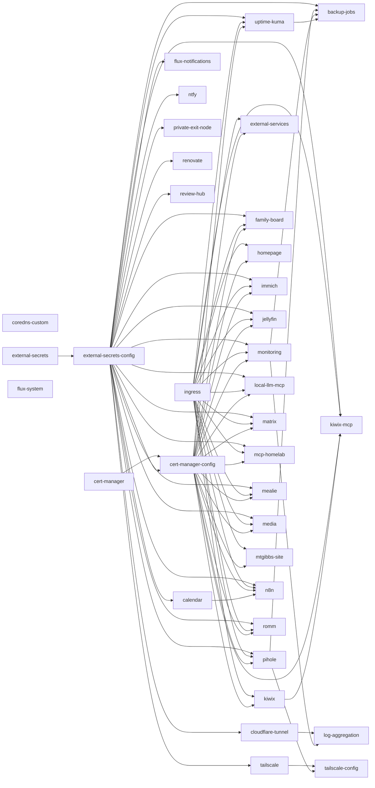

# Domain map — what runs where, needs what, and deploys after what

> The **service lens** on the cluster: for each service (a directory under
> `clusters/pi-k3s/`), what it **runs** (workloads + images), what it **needs**
> (creds, storage), how it's **reached** (ingress), who it **talks to** (in-cluster
> calls), and what must **deploy first** (Flux `dependsOn`). The credential lens is
> [`secrets-map.md`](./secrets-map.md); this map cross-links to it for cred detail.

## How to use this

- **Onboarding a change to service X?** Find its card: its images (🔒priv = a private
  `ghcr.io/mtgibbs` image that needs `ghcr-pull-secret`), the creds it consumes, its PVCs,
  its ingress host, and the services it calls.
- **"What deploys before X?"** → the deploy-order DAG. An arrow A → B means A reconciles first.
  Getting this wrong is the usual cause of a first-boot `ExternalSecret not found` / CRD-missing error.
- **Blast radius of a shared dependency** (e.g. `external-secrets-config`, `ingress`) → follow its
  outgoing arrows in the DAG; everything downstream waits on it.
- **Credentials** → each card lists cred *names*; walk `secrets-map.md` / the `secrets-graph` skill
  for the full item → ExternalSecret → consumer detail and the reuse-before-mint rule.

## Keeping it true (no drift)

Generated from the manifests, like `secrets-map.md`:

```bash
node scripts/gen-domain-map.mjs clusters/pi-k3s --inject docs/domain-map.md
```

Deterministic bytes; CI/pre-merge check = run it, then `git diff --exit-code docs/domain-map.md`.
Modes: `--deps` (DAG mermaid), `--json` (machine graph), default = per-service node index.
Regex-per-document manifest walk — no YAML-parser dependency. What a pod-spec walk can't see
(HelmRelease-managed workloads like cert-manager/monitoring show empty of local workloads; the
Flux ordering still renders) is expected — those services deploy via a `HelmRelease`, not a
Deployment manifest in the dir.

<!-- BEGIN GENERATED:domain-map -->
<!-- Regenerate: node scripts/gen-domain-map.mjs clusters/pi-k3s --inject docs/domain-map.md -->
<!-- Do not hand-edit between these markers; edits are overwritten. -->

_35 services · 66 workloads · 36 Flux Kustomizations · 6 services on a private image. Auto-derived from `clusters/pi-k3s/**`._

## Deploy-order DAG (Flux `dependsOn`)

_What must reconcile before what. An arrow A → B means A deploys before B._



## Services

_Per service: what it runs (🔒priv = private image), needs (creds → `secrets-map.md`, storage), how it's reached (ingress), and who it talks to (calls)._

### backup-jobs  ·  Flux: `backup-jobs` (after: `external-secrets-config`, `pihole`, `monitoring`, `uptime-kuma`)
- **CronJob/git-mirror-backup** — `instrumentisto/rsync-ssh:alpine`
- **CronJob/k3s-datastore-backup** — `instrumentisto/rsync-ssh:alpine`
- **CronJob/mariadb-backup** — `instrumentisto/rsync-ssh:alpine`
- **CronJob/media-backup** — `instrumentisto/rsync-ssh:alpine`
- **CronJob/postgres-backup** — `instrumentisto/rsync-ssh:alpine`
- **CronJob/pvc-backup** — `instrumentisto/rsync-ssh:alpine`
- **CronJob/restore-test** — `instrumentisto/rsync-ssh:alpine`
- **CronJob/unifi-backup** — `alpine:3.24`
- **CronJob/worker2-backup** — `instrumentisto/rsync-ssh:alpine`
  - creds: `immich-db-password`, `matrix-db-password`, `mealie-db-password`, `n8n-db-password`, `romm-db-password`, `unifi-credentials`  _(→ secrets-map.md)_
  - storage: `restore-canary`
  - calls: → `immich`, → `matrix`, → `mealie`, → `n8n`, → `romm`

### calendar  ·  Flux: `calendar` (after: `external-secrets-config`)
- **Deployment/calendar** — `nginx:1.27-alpine`
  - storage: `calendar-data`

### cert-manager  ·  Flux: `cert-manager`

### cert-manager-config  ·  Flux: `cert-manager-config` (after: `cert-manager`, `external-secrets-config`)

### cloudflare-tunnel  ·  Flux: `cloudflare-tunnel` (after: `external-secrets-config`)
- **Deployment/cloudflared** — `alpine:3.24`, `cloudflare/cloudflared:2026.7.2`
  - creds: `cloudflare-tunnel`  _(→ secrets-map.md)_
  - calls: → `calendar`, → `log-aggregation`, → `mtgibbs-site`, → `n8n`, → `ntfy`, → `review-hub`

### coredns-custom  ·  Flux: `coredns-custom`
- **DaemonSet/pi-k3s-hosts-overrides** — `alpine:3.24`

### external-secrets  ·  Flux: `external-secrets`

### external-secrets-config  ·  Flux: `external-secrets-config` (after: `external-secrets`)

### external-services  ·  Flux: `external-services` (after: `ingress`, `cert-manager-config`)
  - ingress: `qnap.lab.mtgibbs.dev`, `unifi.lab.mtgibbs.dev`

### family-board  ·  Flux: `family-board` (after: `external-secrets-config`, `ingress`, `cert-manager-config`)
- **Deployment/family-board** — `nginx:1.27-alpine`
  - creds: `family-board-feed`  _(→ secrets-map.md)_
  - ingress: `board.lab.mtgibbs.dev`

### flux-notifications  ·  Flux: `flux-notifications` (after: `external-secrets-config`)

### homepage  ·  Flux: `homepage` (after: `ingress`, `cert-manager-config`)
- **Deployment/homepage** — `busybox:1.38.0`, `ghcr.io/gethomepage/homepage:v1.13.2`
  - creds: `homepage-ai-controlpanel`, `homepage-immich`, `homepage-jellyfin`, `homepage-pihole`, `homepage-pihole-secondary`, `homepage-servarr`, `homepage-tailscale`, `homepage-unifi`  _(→ secrets-map.md)_
  - ingress: `home.lab.mtgibbs.dev`
  - calls: → `immich`, → `jellyfin`, → `log-aggregation`, → `media`, → `monitoring`, → `pihole`, → `uptime-kuma`

### immich  ·  Flux: `immich` (after: `external-secrets-config`, `ingress`, `cert-manager-config`)
- **Deployment/immich-postgresql** — `ghcr.io/immich-app/postgres:14-vectorchord0.3.0`
  - creds: `immich-secret`  _(→ secrets-map.md)_
  - storage: `immich-postgresql-data`

### ingress  ·  Flux: `ingress`

### jellyfin  ·  Flux: `jellyfin` (after: `external-secrets-config`, `ingress`, `cert-manager-config`)
- **Deployment/jellyfin** — `jellyfin/jellyfin:10.11.11`
  - storage: `jellyfin-config`, `jellyfin-video`
  - ingress: `jellyfin.lab.mtgibbs.dev`

### kiwix  ·  Flux: `kiwix` (after: `ingress`, `cert-manager-config`)
- **Deployment/kiwix** — `ghcr.io/kiwix/kiwix-tools:3.8.2`
- **Job/kiwix-seed** — `curlimages/curl:8.21.0`, `ghcr.io/kiwix/kiwix-tools:3.8.2`
  - storage: `kiwix-zim`
  - ingress: `kiwix.lab.mtgibbs.dev`

### kiwix-mcp  ·  Flux: `kiwix-mcp` (after: `external-secrets-config`, `ingress`, `cert-manager-config`, `kiwix`)
- **Deployment/kiwix-mcp** — `ghcr.io/mtgibbs/kiwix-mcp:0.1.3` 🔒priv
  - creds: `kiwix-mcp-secrets`  _(→ secrets-map.md)_
  - ⚠️ private image → needs `ghcr-pull-secret` (reuse `ghcr-read-token`)
  - ingress: `kiwix-mcp.lab.mtgibbs.dev`
  - calls: → `kiwix`

### local-llm-mcp  ·  Flux: `local-llm-mcp` (after: `external-secrets-config`, `ingress`, `cert-manager-config`)
- **Deployment/local-llm-mcp** — `ghcr.io/mtgibbs/local-llm-mcp:0.1.1` 🔒priv
  - creds: `local-llm-mcp-secrets`  _(→ secrets-map.md)_
  - ⚠️ private image → needs `ghcr-pull-secret` (reuse `ghcr-read-token`)
  - ingress: `local-llm-mcp.lab.mtgibbs.dev`

### log-aggregation  ·  Flux: `log-aggregation` (after: `cloudflare-tunnel`, `monitoring`)
- **Deployment/vector** — `timberio/vector:0.56.0-alpine`
  - creds: `vector-ntfy`  _(→ secrets-map.md)_
  - calls: → `ntfy`

### matrix  ·  Flux: `matrix` (after: `external-secrets-config`, `ingress`, `cert-manager-config`)
- **Deployment/element-web** — `vectorim/element-web:v1.12.23`
- **Deployment/matrix-postgresql** — `postgres:16-alpine`
- **Deployment/synapse** — `matrixdotorg/synapse:v1.156.0`
  - creds: `matrix-secret`  _(→ secrets-map.md)_
  - storage: `matrix-postgresql-data`, `synapse-data`
  - ingress: `element.lab.mtgibbs.dev`, `matrix.lab.mtgibbs.dev`

### mcp-homelab  ·  Flux: `mcp-homelab` (after: `external-secrets-config`, `ingress`, `cert-manager-config`)
- **DaemonSet/mcp-debug-agent** — `nicolaka/netshoot:v0.13`
- **Deployment/mcp-homelab** — `ghcr.io/mtgibbs/pi-cluster-mcp:0.1.24` 🔒priv
  - creds: `mcp-homelab-secrets`  _(→ secrets-map.md)_
  - ⚠️ private image → needs `ghcr-pull-secret` (reuse `ghcr-read-token`)
  - ingress: `mcp.lab.mtgibbs.dev`

### mealie  ·  Flux: `mealie` (after: `external-secrets-config`, `ingress`, `cert-manager-config`)
- **Deployment/mealie** — `ghcr.io/mealie-recipes/mealie:v3.20.1`
- **Deployment/mealie-postgresql** — `postgres:16-alpine`
- **Job/mealie-ai-provider-bootstrap-v3** — `python:3.12-alpine`
  - creds: `mealie-ai-secret`, `mealie-secret`  _(→ secrets-map.md)_
  - storage: `mealie-data`, `mealie-postgresql-data`
  - ingress: `recipes.lab.mtgibbs.dev`

### media  ·  Flux: `media` (after: `external-secrets-config`, `ingress`, `cert-manager-config`)
- **CronJob/import-resolver** — `alpine:3.24`
- **CronJob/orphan-sweep** — `alpine:3.24`
- **Deployment/bazarr** — `linuxserver/bazarr:1.5.6`
- **Deployment/calibre-web** — `lscr.io/linuxserver/calibre-web:0.6.26`
- **Deployment/flaresolverr** — `ghcr.io/flaresolverr/flaresolverr:v3.5.0`
- **Deployment/jellyseerr** — `fallenbagel/jellyseerr:2.7.3`
- **Deployment/lazylibrarian** — `lscr.io/linuxserver/lazylibrarian:6324496a-ls298`
- **Deployment/lidarr** — `linuxserver/lidarr:3.1.0`
- **Deployment/prowlarr** — `linuxserver/prowlarr:2.3.5`
- **Deployment/qbittorrent** — `qmcgaw/gluetun:v3.41.1`, `linuxserver/qbittorrent:5.2.3`
- **Deployment/radarr** — `linuxserver/radarr:6.1.1`
- **Deployment/readarr** — `linuxserver/readarr:0.4.18-develop`
- **Deployment/sabnzbd** — `linuxserver/sabnzbd:5.0.4`
- **Deployment/sonarr** — `linuxserver/sonarr:4.0.17`
  - creds: `protonvpn-credentials`, `qbittorrent-credentials`, `servarr-api-keys`  _(→ secrets-map.md)_
  - storage: `bazarr-config`, `calibre-web-config`, `jellyseerr-config`, `lazylibrarian-config`, `lidarr-config`, `media-books`, `media-downloads`, `media-library`, `media-music`, `prowlarr-config`, `qbittorrent-config`, `radarr-config`, `readarr-config`, `sabnzbd-config`, `sonarr-config`
  - ingress: `bazarr.lab.mtgibbs.dev`, `calibre.lab.mtgibbs.dev`, `lazylibrarian.lab.mtgibbs.dev`, `lidarr.lab.mtgibbs.dev`, `prowlarr.lab.mtgibbs.dev`, `qbit.lab.mtgibbs.dev`, `radarr.lab.mtgibbs.dev`, `readarr.lab.mtgibbs.dev`, `requests.lab.mtgibbs.dev`, `sabnzbd.lab.mtgibbs.dev`, `sonarr.lab.mtgibbs.dev`

### monitoring  ·  Flux: `monitoring` (after: `external-secrets-config`, `ingress`, `cert-manager-config`)
  - ingress: `grafana.lab.mtgibbs.dev`
  - calls: → `log-aggregation`

### mtgibbs-site  ·  Flux: `mtgibbs-site` (after: `ingress`, `cert-manager-config`)
- **Deployment/mtgibbs-site** — `ghcr.io/mtgibbs/mtgibbs.xyz:20260709154535` 🔒priv
  - creds: `mtgibbs-github`, `mtgibbs-spotify`, `mtgibbs-tracking`  _(→ secrets-map.md)_
  - ⚠️ private image → needs `ghcr-pull-secret` (reuse `ghcr-read-token`)
  - ingress: `site.lab.mtgibbs.dev`

### n8n  ·  Flux: `n8n` (after: `external-secrets-config`, `ingress`, `cert-manager-config`, `calendar`)
- **Deployment/n8n** — `n8nio/n8n:2.23.4`
- **Deployment/n8n-postgresql** — `postgres:16-alpine`
- **Deployment/n8n-valkey** — `valkey/valkey:8-alpine`
- **Deployment/n8n-webhook** — `n8nio/n8n:2.23.4`
- **Deployment/n8n-worker** — `n8nio/n8n:2.23.4`
  - creds: `n8n-secret`  _(→ secrets-map.md)_
  - storage: `n8n-calendar`, `n8n-data`, `n8n-postgresql-data`, `n8n-valkey-data`
  - ingress: `n8n.lab.mtgibbs.dev`

### ntfy  ·  Flux: `ntfy` (after: `external-secrets-config`)
- **Deployment/ntfy** — `binwiederhier/ntfy:v2.26.0`
  - creds: `ntfy-secret`  _(→ secrets-map.md)_
  - storage: `ntfy-data`

### pihole  ·  Flux: `pihole` (after: `external-secrets-config`, `ingress`, `cert-manager-config`)
- **CronJob/pihole-brainrot-allow** — `alpine:3.24`
- **CronJob/pihole-brainrot-block** — `alpine:3.24`
- **Deployment/pihole** — `pihole/pihole:2026.05.0`
- **Deployment/pihole-exporter** — `ekofr/pihole-exporter:v1.2.0`
- **Deployment/pihole-exporter-secondary** — `ekofr/pihole-exporter:v1.2.0`
- **Deployment/pihole-secondary** — `pihole/pihole:2026.05.0`
- **Deployment/unbound** — `madnuttah/unbound:1.19.0`
- **Deployment/unbound-secondary** — `madnuttah/unbound:1.19.0`
- **Job/pihole-brainrot-setup-adgroups-2** — `alpine:3.24`
  - creds: `pihole-secret`  _(→ secrets-map.md)_
  - storage: `pihole-dnsmasq`, `pihole-dnsmasq-secondary`, `pihole-etc`, `pihole-etc-secondary`
  - ingress: `pihole.lab.mtgibbs.dev`

### private-exit-node  ·  Flux: `private-exit-node` (after: `external-secrets-config`)
- **Deployment/exit-node-gateway** — `ghcr.io/mtgibbs/private-exit-node:0.1.0` 🔒priv
  - creds: `exit-node-secrets`, `ghcr-pull-secret`  _(→ secrets-map.md)_
  - ⚠️ private image → needs `ghcr-pull-secret` (reuse `ghcr-read-token`)

### renovate  ·  Flux: `renovate` (after: `external-secrets-config`)
- **CronJob/renovate** — `renovate/renovate:43`
  - creds: `renovate-secrets`  _(→ secrets-map.md)_

### review-hub  ·  Flux: `review-hub` (after: `external-secrets-config`)
- **Deployment/review-hub** — `ghcr.io/mtgibbs/review-hub:0.7.3` 🔒priv
  - creds: `review-hub-secrets`  _(→ secrets-map.md)_
  - ⚠️ private image → needs `ghcr-pull-secret` (reuse `ghcr-read-token`)

### romm  ·  Flux: `romm` (after: `external-secrets-config`, `ingress`, `cert-manager-config`)
- **Deployment/romm** — `rommapp/romm:4.9.2`
- **Deployment/romm-mariadb** — `mariadb:11.4`
  - creds: `romm-secret`  _(→ secrets-map.md)_
  - storage: `romm-config`, `romm-games`, `romm-mariadb-data`, `romm-redis-data`
  - ingress: `romm.lab.mtgibbs.dev`

### tailscale  ·  Flux: `tailscale` (after: `external-secrets-config`)

### tailscale-config  ·  Flux: `tailscale-config` (after: `tailscale`, `pihole`)

### uptime-kuma  ·  Flux: `uptime-kuma` (after: `external-secrets-config`, `ingress`, `cert-manager-config`)
- **Deployment/autokuma** — `alpine:3.24`, `ghcr.io/bigboot/autokuma:2.0.0@sha256:8acbd3ad3ec8cb6c066aa0ee541154921283ec78159015937128541921c47974`
- **Deployment/uptime-kuma** — `louislam/uptime-kuma:2`
  - creds: `uptime-kuma-secret`  _(→ secrets-map.md)_
  - storage: `autokuma-data`, `uptime-kuma-data`
  - ingress: `status.lab.mtgibbs.dev`
  - calls: → `log-aggregation`, → `monitoring`, → `pihole`, → `review-hub`, → `tailscale`

<!-- END GENERATED:domain-map -->
