# Secrets map — what exists, what it's for, and when NOT to mint a new one

> Read this **before adding any credential to a new or existing service.** It exists because an agent
> (me) invented a `ghcr-pull` token in 2026-08 when `ghcr-read-token` already did the job — the exact
> mistake this map prevents.

## The one rule

**Reuse before mint.** Shared *infrastructure* identities (pull images, send alerts, reach the NAS)
are one-per-role, not one-per-service. A new service references the existing item; it does **not**
create a parallel token. Mint a new secret only for a genuinely **per-workload** cred (this service's
own DB password, its own scoped LiteLLM key). When unsure: check the **auto-derived connectivity
graph at the bottom of this file** (every 1Password item + its fan-out + `⟵ SHARED` flags), the
curated tables below, or `grep -r "remoteRef" clusters/`. To walk it as an agent, load the
`secrets-graph` skill.

## How secrets work here

- Source of truth: **1Password**, vault `pi-cluster`. Nothing secret is committed — only `op://` paths.
- Delivery: **External Secrets Operator** → `ClusterSecretStore` named `onepassword`. Each service has
  an `ExternalSecret` mapping `remoteRef.key: <item>/<field>` → a k8s Secret in its namespace.
- Path shape: `op://pi-cluster/<item>/<field>` ⇄ `remoteRef: { key: <item>/<field> }`.

## Shared identities — REUSE, do not mint a parallel one

| Role | 1Password item | Materializes as | Used by |
|---|---|---|---|
| **Pull private GHCR images** | `ghcr-read-token/token` | `ghcr-pull-secret` (per-ns `dockerconfigjson`) + Flux `ghcr-credentials` | Flux image-automation (all `ghcr.io/mtgibbs/*`) + any private-image workload (`private-exit-node`; now new-horizons). **New private service:** copy `external-secret-ghcr.yaml` into its ns + `imagePullSecrets: [ghcr-pull-secret]`. Zero new creds. |
| **Push alerts** | `ntfy/family-password`, `discord-alerts/webhook-url`, `alertmanager/discord-alerts-webhook-url`, `healthchecks/watchdog-ping-url` | per-consumer Secret/env | ntfy family channel, Alertmanager→Discord, external watchdog. Reuse the topic/webhook — don't stand up a new alert identity per service. |
| **Reach the NAS (QNAP)** | `nas/uid`, `nas/gid`, `mcp-homelab/nas-private-key` | env / ssh key | backup jobs, media, anything mounting/rsync'ing the NAS. |
| **Cloudflare (DNS/tunnel)** | `cloudflare/api-token` (DNS-only), `cloudflare-tunnel/tunnel-token` | — | cert-manager DNS01, the tunnel. ⚠️ `cloudflare` token is **DNS-only** — not R2/Email/Workers. |
| **GitHub (as the automation)** | `mtgibbs-github/token`, `github-mirror-token/token`, the **review-hub GitHub App** | — | mirror backups, Renovate, PR review. Prefer the App for repo actions; one identity across repos. |

## Per-workload by design — mint one per service (NOT sprawl, just scope)

| Kind | Examples | Why separate |
|---|---|---|
| **LiteLLM virtual key** | `local-llm-mcp/litellm-key`, `mealie/litellm-key`, `review-hub/litellm-key`, `new-horizons/litellm-key` | Deliberate: per-consumer **cost attribution**, independent **rotation/revocation**, and **model scoping**. This is what virtual keys are for — not a violation of "reuse." |
| **App DB / app secrets** | `n8n/*`, `matrix/*`, `immich/*`, `mealie/db-password`, `grafana/password`, `pihole/password` | Genuinely private to that app. |
| **Service accounts / API tokens for that app** | `mtgibbs-spotify/*`, `opensubtitles/*`, `newshosting/*`, `protonvpn-credentials/*` | Third-party creds owned by one service. |

## Handling tiers (who/what may touch a cred)

1. **Safe, read-only** — pull tokens, LiteLLM keys, endpoints. Fine for automation; the *right* way to
   expose these to the harness is a **homelab-MCP diagnostic** (e.g. "verify this pull works"), **not** a
   raw keystore. See `[[reference_harness_claude_capabilities]]`.
2. **Cluster-acting** — `mcp-homelab/*` (restart/exec), kubeconfig. Behind the MCP's own auth; not on the
   harness hot path.
3. **Crown jewel** — anything that can destroy data or move money; stays **biometric / laptop-only**,
   never relocated into a container. (`backup-ops` SKILL, the op Touch-ID creds.)

**Image + PII note:** an image that bakes in PII (e.g. new-horizons' `profile/` = résumé) stays a
**private** GHCR package (pulled via `ghcr-read-token`). Only PII-free images may be public.

## Checklist — adding secrets to a service

1. **Pull a private image?** → reuse `ghcr-read-token` → `ghcr-pull-secret` (table above). Don't mint.
2. **Send alerts?** → reuse the ntfy topic / Discord webhook. Don't mint an alert identity.
3. **Call the local LLM?** → mint **one** scoped `op://pi-cluster/<service>/litellm-key` (per-workload,
   on purpose).
4. **App's own DB/API secret?** → mint `op://pi-cluster/<service>/<field>`, one `ExternalSecret`.
5. Never commit a value; only the `op://` path. Grep `clusters/` for the role before creating anything.

<!-- BEGIN GENERATED:secrets-graph -->
<!-- Regenerate with: node scripts/gen-secrets-graph.mjs clusters --inject docs/secrets-map.md -->
<!-- Do not hand-edit between these markers; edits are overwritten. Curate roles/tiers ABOVE, and the
     un-derivable consumers (HelmRelease/Flux/ClusterIssuer/app-config) in docs/secrets-overlay.yaml. -->

## Connectivity graph (auto-derived from `clusters/**`)

_55 ExternalSecrets · 41 1Password items · 66 consumer edges · 14 shared identities. Skeleton is regenerated; the un-derivable consumers come from `docs/secrets-overlay.yaml`._

### Reuse lens — shared identities and their fan-out

```mermaid
graph LR
  n1uid43c(["🔑 ghcr-read-token"])
  n1dgsmvl["ghcr-pull-secret<br/>(flux-system)"]
  n1uid43c --> n1dgsmvl
  n1v7jq0b["ghcr-pull-secret<br/>(new-horizons)"]
  n1uid43c --> n1v7jq0b
  nada4m5["ghcr-pull-secret<br/>(private-exit-node)"]
  n1uid43c --> nada4m5
  n1ofxib0(["🔑 immich"])
  ny2dudm["immich-db-password<br/>(backup-jobs)"]
  n1ofxib0 --> ny2dudm
  n5hax0d["homepage-immich<br/>(homepage)"]
  n1ofxib0 --> n5hax0d
  n1jrvgeg["immich-secret<br/>(immich)"]
  n1ofxib0 --> n1jrvgeg
  n1q5n4i0(["🔑 matrix"])
  nl4z3ja["matrix-db-password<br/>(backup-jobs)"]
  n1q5n4i0 --> nl4z3ja
  n1pub2h4["matrix-secret<br/>(matrix)"]
  n1q5n4i0 --> n1pub2h4
  nsg65ys(["🔑 mcp-homelab"])
  nsujb4j["homepage-servarr<br/>(homepage)"]
  nsg65ys --> nsujb4j
  n1onwzk3["mcp-homelab-secrets<br/>(mcp-homelab)"]
  nsg65ys --> n1onwzk3
  nghdbx9["mealie-ai-secret<br/>(mealie)"]
  nsg65ys --> nghdbx9
  n1q7i1nq(["🔑 mealie"])
  nlf4zo["mealie-db-password<br/>(backup-jobs)"]
  n1q7i1nq --> nlf4zo
  n1q7i1nq --> nghdbx9
  n14gjuh4["mealie-secret<br/>(mealie)"]
  n1q7i1nq --> n14gjuh4
  nez177h(["🔑 n8n"])
  n12hamnt["n8n-db-password<br/>(backup-jobs)"]
  nez177h --> n12hamnt
  n1c98ym["n8n-secret<br/>(n8n)"]
  nez177h --> n1c98ym
  n11ze3z4(["🔑 ntfy"])
  nojsaoj["vector-ntfy<br/>(log-aggregation)"]
  n11ze3z4 --> nojsaoj
  nldvrgo["ntfy-secret<br/>(ntfy)"]
  n11ze3z4 --> nldvrgo
  n1roymf4(["🔑 pihole"])
  n8qc14h["homepage-pihole<br/>(homepage)"]
  n1roymf4 --> n8qc14h
  n1k98biw["homepage-pihole-secondary<br/>(homepage)"]
  n1roymf4 --> n1k98biw
  n1roymf4 --> n1onwzk3
  n3et26g["pihole-secret<br/>(pihole)"]
  n1roymf4 --> n3et26g
  n1ivmgwl(["🔑 radarr.lab.mtgibbs.dev"])
  n1ivmgwl --> nsujb4j
  n1y414oe["servarr-api-keys<br/>(media)"]
  n1ivmgwl --> n1y414oe
  n11zgkdg(["🔑 romm"])
  n16tyf6["romm-db-password<br/>(backup-jobs)"]
  n11zgkdg --> n16tyf6
  n1la4zm0["romm-secret<br/>(romm)"]
  n11zgkdg --> n1la4zm0
  n2hueew(["🔑 sonarr.lab.mtgibbs.dev"])
  n2hueew --> nsujb4j
  n2hueew --> n1y414oe
  nl58ty6(["🔑 synology_backup"])
  nwkg7g7["backup-ssh-key<br/>(backup-jobs)"]
  nl58ty6 --> nwkg7g7
  n1qkhz78["backup-ssh-key<br/>(media)"]
  nl58ty6 --> n1qkhz78
  n1naqehf(["🔑 tailscale"])
  nngykci["homepage-tailscale<br/>(homepage)"]
  n1naqehf --> nngykci
  n1x2g4ot["operator-oauth<br/>(tailscale)"]
  n1naqehf --> n1x2g4ot
  n1533bpo(["🔑 unifi"])
  n16b5hkq["unifi-credentials<br/>(backup-jobs)"]
  n1533bpo --> n16b5hkq
  n1ln5yrf["homepage-unifi<br/>(homepage)"]
  n1533bpo --> n1ln5yrf
```

### 1Password items — source of truth (shared = reuse before mint)

- **ai-controlpanel** → 1 ExternalSecret(s):
    - `homepage/homepage-ai-controlpanel`
- **alertmanager** → 1 ExternalSecret(s):
    - `monitoring/alertmanager-discord`
- **calibre-web-smtp** → 1 ExternalSecret(s):
    - `media/calibre-web-smtp`
- **cloudflare** → 1 ExternalSecret(s):
    - `cert-manager/cloudflare-api-token`
- **cloudflare-tunnel** → 1 ExternalSecret(s):
    - `cloudflare-tunnel/cloudflare-tunnel`
- **discord-alerts** → 1 ExternalSecret(s):
    - `flux-system/discord-webhook`
- **ghcr-read-token** `safe` → 3 ExternalSecret(s):  ⟵ **SHARED — reuse, do not mint a parallel one**
    - `flux-system/ghcr-pull-secret`
    - `new-horizons/ghcr-pull-secret`
    - `private-exit-node/ghcr-pull-secret`
- **github-mirror-token** → 1 ExternalSecret(s):
    - `backup-jobs/github-mirror-token`
- **grafana** → 1 ExternalSecret(s):
    - `monitoring/grafana-secret`
- **healthchecks** → 1 ExternalSecret(s):
    - `monitoring/alertmanager-healthchecks`
- **immich** → 3 ExternalSecret(s):  ⟵ **SHARED — reuse, do not mint a parallel one**
    - `backup-jobs/immich-db-password`
    - `homepage/homepage-immich`
    - `immich/immich-secret`
- **jellyfin** → 1 ExternalSecret(s):
    - `homepage/homepage-jellyfin`
- **kiwix-mcp** → 1 ExternalSecret(s):
    - `kiwix-mcp/kiwix-mcp-secrets`
- **local-llm-mcp** → 1 ExternalSecret(s):
    - `local-llm-mcp/local-llm-mcp-secrets`
- **matrix** → 2 ExternalSecret(s):  ⟵ **SHARED — reuse, do not mint a parallel one**
    - `backup-jobs/matrix-db-password`
    - `matrix/matrix-secret`
- **mcp-homelab** `cluster-acting` → 3 ExternalSecret(s):  ⟵ **SHARED — reuse, do not mint a parallel one**
    - `homepage/homepage-servarr`
    - `mcp-homelab/mcp-homelab-secrets`
    - `mealie/mealie-ai-secret`
- **mealie** → 3 ExternalSecret(s):  ⟵ **SHARED — reuse, do not mint a parallel one**
    - `backup-jobs/mealie-db-password`
    - `mealie/mealie-ai-secret`
    - `mealie/mealie-secret`
- **mtgibbs-github** → 1 ExternalSecret(s):
    - `mtgibbs-site/mtgibbs-github`
- **mtgibbs-spotify** → 1 ExternalSecret(s):
    - `mtgibbs-site/mtgibbs-spotify`
- **mtgibbs-tracking** → 1 ExternalSecret(s):
    - `mtgibbs-site/mtgibbs-tracking`
- **n8n** → 2 ExternalSecret(s):  ⟵ **SHARED — reuse, do not mint a parallel one**
    - `backup-jobs/n8n-db-password`
    - `n8n/n8n-secret`
- **n8n-automation** → 1 ExternalSecret(s):
    - `family-board/family-board-feed`
- **nas** `crown-jewel` → 1 ExternalSecret(s):
    - `flux-system/nfs-credentials`
- **new-horizons** → 1 ExternalSecret(s):
    - `new-horizons/new-horizons-secrets`
- **newshosting** → 1 ExternalSecret(s):
    - `media/newshosting-credentials`
- **ntfy** → 2 ExternalSecret(s):  ⟵ **SHARED — reuse, do not mint a parallel one**
    - `log-aggregation/vector-ntfy`
    - `ntfy/ntfy-secret`
- **opensubtitles** → 1 ExternalSecret(s):
    - `media/opensubtitles-credentials`
- **pihole** → 4 ExternalSecret(s):  ⟵ **SHARED — reuse, do not mint a parallel one**
    - `homepage/homepage-pihole`
    - `homepage/homepage-pihole-secondary`
    - `mcp-homelab/mcp-homelab-secrets`
    - `pihole/pihole-secret`
- **private-exit-node** → 1 ExternalSecret(s):
    - `private-exit-node/exit-node-secrets`
- **protonvpn-credentials** → 1 ExternalSecret(s):
    - `media/protonvpn-credentials`
- **qbit.lab.mtgibbs.dev** → 1 ExternalSecret(s):
    - `media/qbittorrent-credentials`
- **radarr.lab.mtgibbs.dev** → 2 ExternalSecret(s):  ⟵ **SHARED — reuse, do not mint a parallel one**
    - `homepage/homepage-servarr`
    - `media/servarr-api-keys`
- **renovate** → 1 ExternalSecret(s):
    - `renovate/renovate-secrets`
- **review-hub** → 1 ExternalSecret(s):
    - `review-hub/review-hub-secrets`
- **romm** → 2 ExternalSecret(s):  ⟵ **SHARED — reuse, do not mint a parallel one**
    - `backup-jobs/romm-db-password`
    - `romm/romm-secret`
- **sabnzbd.lab.mtgibbs.dev** → 1 ExternalSecret(s):
    - `homepage/homepage-servarr`
- **sonarr.lab.mtgibbs.dev** → 2 ExternalSecret(s):  ⟵ **SHARED — reuse, do not mint a parallel one**
    - `homepage/homepage-servarr`
    - `media/servarr-api-keys`
- **synology_backup** `crown-jewel` → 2 ExternalSecret(s):  ⟵ **SHARED — reuse, do not mint a parallel one**
    - `backup-jobs/backup-ssh-key`
    - `media/backup-ssh-key`
- **tailscale** → 2 ExternalSecret(s):  ⟵ **SHARED — reuse, do not mint a parallel one**
    - `homepage/homepage-tailscale`
    - `tailscale/operator-oauth`
- **unifi** → 2 ExternalSecret(s):  ⟵ **SHARED — reuse, do not mint a parallel one**
    - `backup-jobs/unifi-credentials`
    - `homepage/homepage-unifi`
- **uptime-kuma** → 1 ExternalSecret(s):
    - `uptime-kuma/uptime-kuma-secret`

### ExternalSecret → k8s Secret → consumers

- **`backup-jobs/backup-ssh-key`** ← `synology_backup`
  produces Secret `backup-ssh-key` in `backup-jobs`
    → `backup-jobs/git-mirror-backup` (CronJob, volume)
    → `backup-jobs/k3s-datastore-backup` (CronJob, volume)
    → `backup-jobs/mariadb-backup` (CronJob, volume)
    → `backup-jobs/media-backup` (CronJob, volume)
    → `backup-jobs/postgres-backup` (CronJob, volume)
    → `backup-jobs/pvc-backup` (CronJob, volume)
    → `backup-jobs/restore-test` (CronJob, volume)
    → `backup-jobs/unifi-backup` (CronJob, volume)
    → `backup-jobs/worker2-backup` (CronJob, volume)
- **`backup-jobs/github-mirror-token`** ← `github-mirror-token`
  produces Secret `github-mirror-token` in `backup-jobs`
    → `backup-jobs/git-mirror-backup` (CronJob, volume)
- **`backup-jobs/immich-db-password`** ← `immich`
  produces Secret `immich-db-password` in `backup-jobs`
    → `backup-jobs/postgres-backup` (CronJob, env)
- **`backup-jobs/matrix-db-password`** ← `matrix`
  produces Secret `matrix-db-password` in `backup-jobs`
    → `backup-jobs/postgres-backup` (CronJob, env)
- **`backup-jobs/mealie-db-password`** ← `mealie`
  produces Secret `mealie-db-password` in `backup-jobs`
    → `backup-jobs/postgres-backup` (CronJob, env)
- **`backup-jobs/n8n-db-password`** ← `n8n`
  produces Secret `n8n-db-password` in `backup-jobs`
    → `backup-jobs/postgres-backup` (CronJob, env)
- **`backup-jobs/romm-db-password`** ← `romm`
  produces Secret `romm-db-password` in `backup-jobs`
    → `backup-jobs/mariadb-backup` (CronJob, env)
- **`backup-jobs/unifi-credentials`** ← `unifi`
  produces Secret `unifi-credentials` in `backup-jobs`
    → `backup-jobs/unifi-backup` (CronJob, env)
- **`cert-manager/cloudflare-api-token`** ← `cloudflare`
  produces Secret `cloudflare-api-token` in `cert-manager`
    → _cert-manager ClusterIssuer (DNS01 apiTokenSecretRef)_ (curated: not a pod-spec ref)
- **`cloudflare-tunnel/cloudflare-tunnel`** ← `cloudflare-tunnel`
  produces Secret `cloudflare-tunnel` in `cloudflare-tunnel`
    → `cloudflare-tunnel/cloudflared` (Deployment, env)
    → `cloudflare-tunnel/cloudflared` (Deployment, volume)
- **`family-board/family-board-feed`** ← `n8n-automation`
  produces Secret `family-board-feed` in `family-board`
    → `family-board/family-board` (Deployment, env)
- **`flux-system/discord-webhook`** ← `discord-alerts`
  produces Secret `discord-webhook` in `flux-system`
    → _Flux notification-controller (Provider in flux-notifications/)_ (curated: not a pod-spec ref)
- **`flux-system/ghcr-pull-secret`** ← `ghcr-read-token`
  produces Secret `ghcr-pull-secret` in `flux-system`
    → _Flux source/kustomize/helm controllers (ghcr.io/mtgibbs registry auth)_ (curated: not a pod-spec ref)
- **`flux-system/nfs-credentials`** ← `nas`
  produces Secret `nfs-credentials` in `flux-system`
    → _Flux Kustomizations (postBuild.substituteFrom NAS uid/gid, 4 refs in infrastructure.yaml)_ (curated: not a pod-spec ref)
- **`homepage/homepage-ai-controlpanel`** ← `ai-controlpanel`
  produces Secret `homepage-ai-controlpanel` in `homepage`
    → `homepage/homepage` (Deployment, envFrom)
- **`homepage/homepage-immich`** ← `immich`
  produces Secret `homepage-immich` in `homepage`
    → `homepage/homepage` (Deployment, envFrom)
- **`homepage/homepage-jellyfin`** ← `jellyfin`
  produces Secret `homepage-jellyfin` in `homepage`
    → `homepage/homepage` (Deployment, envFrom)
- **`homepage/homepage-pihole`** ← `pihole`
  produces Secret `homepage-pihole` in `homepage`
    → `homepage/homepage` (Deployment, envFrom)
- **`homepage/homepage-pihole-secondary`** ← `pihole`
  produces Secret `homepage-pihole-secondary` in `homepage`
    → `homepage/homepage` (Deployment, envFrom)
- **`homepage/homepage-servarr`** ← `mcp-homelab`, `radarr.lab.mtgibbs.dev`, `sabnzbd.lab.mtgibbs.dev`, `sonarr.lab.mtgibbs.dev`
  produces Secret `homepage-servarr` in `homepage`
    → `homepage/homepage` (Deployment, envFrom)
- **`homepage/homepage-tailscale`** ← `tailscale`
  produces Secret `homepage-tailscale` in `homepage`
    → `homepage/homepage` (Deployment, envFrom)
- **`homepage/homepage-unifi`** ← `unifi`
  produces Secret `homepage-unifi` in `homepage`
    → `homepage/homepage` (Deployment, envFrom)
- **`immich/immich-secret`** ← `immich`
  produces Secret `immich-secret` in `immich`
    → `immich/immich-postgresql` (Deployment, env)
- **`kiwix-mcp/kiwix-mcp-secrets`** ← `kiwix-mcp`
  produces Secret `kiwix-mcp-secrets` in `kiwix-mcp`
    → `kiwix-mcp/kiwix-mcp` (Deployment, env)
- **`local-llm-mcp/local-llm-mcp-secrets`** ← `local-llm-mcp`
  produces Secret `local-llm-mcp-secrets` in `local-llm-mcp`
    → `local-llm-mcp/local-llm-mcp` (Deployment, env)
- **`log-aggregation/vector-ntfy`** ← `ntfy`
  produces Secret `vector-ntfy` in `log-aggregation`
    → `log-aggregation/vector` (Deployment, env)
- **`matrix/matrix-secret`** ← `matrix`
  produces Secret `matrix-secret` in `matrix`
    → `matrix/matrix-postgresql` (Deployment, env)
    → `matrix/synapse` (Deployment, volume)
- **`mcp-homelab/mcp-homelab-secrets`** ← `mcp-homelab`, `pihole`
  produces Secret `mcp-homelab-secrets` in `mcp-homelab`
    → `mcp-homelab/mcp-homelab` (Deployment, env)
    → `mcp-homelab/mcp-homelab` (Deployment, volume)
- **`mealie/mealie-ai-secret`** ← `mcp-homelab`, `mealie`
  produces Secret `mealie-ai-secret` in `mealie`
    → `mealie/mealie-ai-provider-bootstrap-v3` (Job, env)
- **`mealie/mealie-secret`** ← `mealie`
  produces Secret `mealie-secret` in `mealie`
    → `mealie/mealie-postgresql` (Deployment, env)
    → `mealie/mealie` (Deployment, env)
- **`media/backup-ssh-key`** ← `synology_backup`
  produces Secret `backup-ssh-key` in `media`
    → `media/restore-__APP__` (Job, volume)
- **`media/calibre-web-smtp`** ← `calibre-web-smtp`
  produces Secret `calibre-web-smtp` in `media`
    → _calibre-web SMTP config (app-internal env; verify)_ (curated: not a pod-spec ref)
- **`media/newshosting-credentials`** ← `newshosting`
  produces Secret `newshosting-credentials` in `media`
    → _SABnzbd server config (app-internal; NOT a manifest ref — verify or prune)_ (curated: not a pod-spec ref)
- **`media/opensubtitles-credentials`** ← `opensubtitles`
  produces Secret `opensubtitles-credentials` in `media`
    → _Bazarr provider config (app-internal; NOT a manifest ref — verify or prune)_ (curated: not a pod-spec ref)
- **`media/protonvpn-credentials`** ← `protonvpn-credentials`
  produces Secret `protonvpn-credentials` in `media`
    → `media/qbittorrent` (Deployment, env)
- **`media/qbittorrent-credentials`** ← `qbit.lab.mtgibbs.dev`
  produces Secret `qbittorrent-credentials` in `media`
    → `media/qbittorrent` (Deployment, env)
- **`media/servarr-api-keys`** ← `radarr.lab.mtgibbs.dev`, `sonarr.lab.mtgibbs.dev`
  produces Secret `servarr-api-keys` in `media`
    → `media/import-resolver` (CronJob, env)
- **`monitoring/alertmanager-discord`** ← `alertmanager`
  produces Secret `alertmanager-discord` in `monitoring`
    → _kube-prometheus-stack HelmRelease (Alertmanager Discord receiver, valuesFrom)_ (curated: not a pod-spec ref)
- **`monitoring/alertmanager-healthchecks`** ← `healthchecks`
  produces Secret `alertmanager-healthchecks` in `monitoring`
    → _kube-prometheus-stack HelmRelease (Alertmanager watchdog ping, valuesFrom)_ (curated: not a pod-spec ref)
- **`monitoring/grafana-secret`** ← `grafana`
  produces Secret `grafana-secret` in `monitoring`
    → _kube-prometheus-stack HelmRelease (grafana.admin existingSecret)_ (curated: not a pod-spec ref)
- **`mtgibbs-site/mtgibbs-github`** ← `mtgibbs-github`
  produces Secret `mtgibbs-github` in `mtgibbs-site`
    → `mtgibbs-site/mtgibbs-site` (Deployment, envFrom)
- **`mtgibbs-site/mtgibbs-spotify`** ← `mtgibbs-spotify`
  produces Secret `mtgibbs-spotify` in `mtgibbs-site`
    → `mtgibbs-site/mtgibbs-site` (Deployment, envFrom)
- **`mtgibbs-site/mtgibbs-tracking`** ← `mtgibbs-tracking`
  produces Secret `mtgibbs-tracking` in `mtgibbs-site`
    → `mtgibbs-site/mtgibbs-site` (Deployment, envFrom)
- **`n8n/n8n-secret`** ← `n8n`
  produces Secret `n8n-secret` in `n8n`
    → `n8n/n8n-postgresql` (Deployment, env)
    → `n8n/n8n-webhook` (Deployment, envFrom)
    → `n8n/n8n-worker` (Deployment, envFrom)
    → `n8n/n8n` (Deployment, envFrom)
- **`new-horizons/ghcr-pull-secret`** ← `ghcr-read-token`
  produces Secret `ghcr-pull-secret` in `new-horizons`
    → `new-horizons/new-horizons` (Deployment, imagePull)
- **`new-horizons/new-horizons-secrets`** ← `new-horizons`
  produces Secret `new-horizons-secrets` in `new-horizons`
    → `new-horizons/new-horizons` (Deployment, env)
- **`ntfy/ntfy-secret`** ← `ntfy`
  produces Secret `ntfy-secret` in `ntfy`
    → `ntfy/ntfy` (Deployment, env)
- **`pihole/pihole-secret`** ← `pihole`
  produces Secret `pihole-secret` in `pihole`
    → `pihole/pihole-brainrot-allow` (CronJob, env)
    → `pihole/pihole-brainrot-block` (CronJob, env)
    → `pihole/pihole-brainrot-setup-adgroups-2` (Job, env)
    → `pihole/pihole-exporter-secondary` (Deployment, env)
    → `pihole/pihole-exporter` (Deployment, env)
    → `pihole/pihole-secondary` (Deployment, env)
    → `pihole/pihole` (Deployment, env)
- **`private-exit-node/exit-node-secrets`** ← `private-exit-node`
  produces Secret `exit-node-secrets` in `private-exit-node`
    → `private-exit-node/exit-node-gateway` (Deployment, env)
- **`private-exit-node/ghcr-pull-secret`** ← `ghcr-read-token`
  produces Secret `ghcr-pull-secret` in `private-exit-node`
    → `private-exit-node/exit-node-gateway` (Deployment, imagePull)
- **`renovate/renovate-secrets`** ← `renovate`
  produces Secret `renovate-secrets` in `renovate`
    → `renovate/renovate` (CronJob, envFrom)
- **`review-hub/review-hub-secrets`** ← `review-hub`
  produces Secret `review-hub-secrets` in `review-hub`
    → `review-hub/review-hub` (Deployment, env)
- **`romm/romm-secret`** ← `romm`
  produces Secret `romm-secret` in `romm`
    → `romm/romm-mariadb` (Deployment, env)
    → `romm/romm` (Deployment, env)
- **`tailscale/operator-oauth`** ← `tailscale`
  produces Secret `operator-oauth` in `tailscale`
    → _tailscale-operator HelmRelease (OAuth client for the operator)_ (curated: not a pod-spec ref)
- **`uptime-kuma/uptime-kuma-secret`** ← `uptime-kuma`
  produces Secret `uptime-kuma-secret` in `uptime-kuma`
    → `uptime-kuma/autokuma` (Deployment, env)

<!-- END GENERATED:secrets-graph -->
